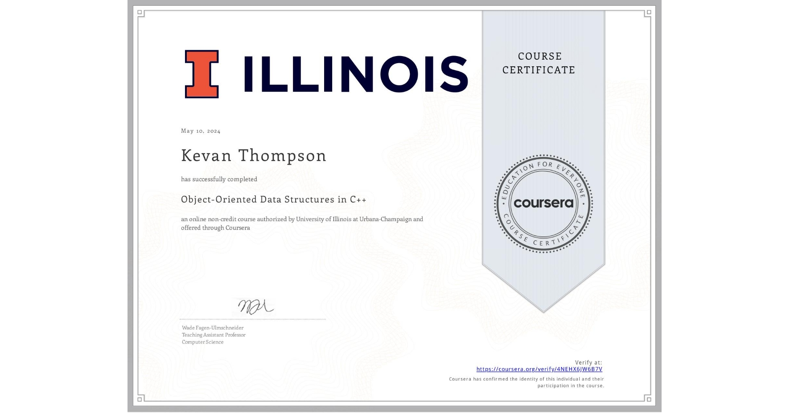

# Object-Oriented Data Structures in C++
___
This course teaches learners how to write a program in the C++ language, including how to set up a development environment for writing and debugging C++ code and how to implement data structures as C++ classes. It is the first course in the Accelerated CS Fundamentals specialization, and subsequent courses in this specialization will be using C++ as the language for implementing the data structures covered in class.

